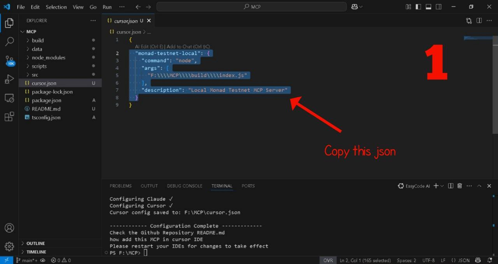
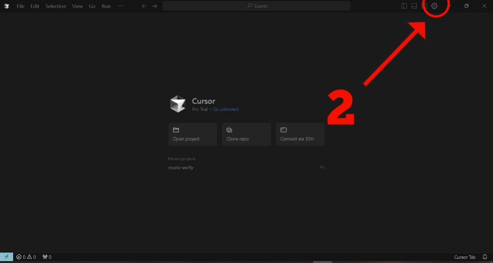
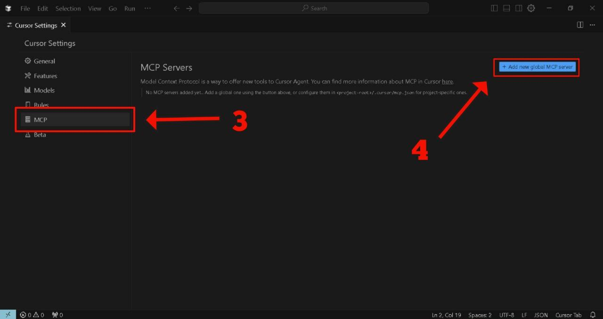
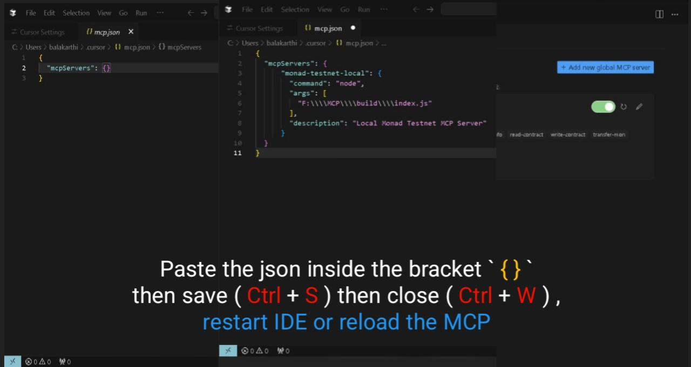

# Monad Testnet MCP Server

This project provides a Model Context Protocol (MCP) server that allows AI assistants like Claude or Cursor to interact with the Monad Testnet blockchain. You can use it to perform actions like checking balances, deploying contracts, interacting with tokens, and more, directly through your AI assistant.

## Setup

1.  **Install Dependencies and Configure:**
    Run the following command in your terminal. This will install necessary packages, automatically configure the server for Claude by creating/updating `cursor.json` and potentially `claude_desktop_config.json`, and build the server code:
    ```bash
    npm run setup
    ```
    *   This script (`scripts/configure-mcp.js`) generates the necessary configuration snippet (`cursor.json`) in the project root, pointing to the built server (`build/index.js`).

2.  **Add MCP Server to Cursor IDE:**
    Follow these steps to integrate the configured MCP server into your Cursor IDE:

    1.  **Copy Configuration:** The `npm run setup` command creates a `cursor.json` file in the project's root directory (`drive:\PATH\cursor.json`). Open this file and copy its entire content.
        
    2.  **Open Cursor Settings:** In Cursor, go to `File -> Preferences -> Settings` (or use the shortcut `Ctrl+,`). Search for "MCP".
        
    3.  **Edit MCP Settings:** Click on "Edit in settings.json" under the "Cursor › Mcp: Servers" section.
        
    4.  **Paste Configuration:** Paste the copied configuration content into the `mcp.json` file, ensuring it's correctly placed within the JSON structure (usually as a new key-value pair within the main object, or merging if the key already exists). Save the `mcp.json` file.
        

3.  **Restart Cursor:** Restart your Cursor IDE for the changes to take effect. The "monad-testnet-local" server should now be available as an MCP option.

## Usage

Once set up, you can invoke the MCP server's capabilities through your AI assistant in Cursor. Refer to the server's capabilities (defined in `src/index.ts`) for available commands like `get-mon-balance`, `deploy-contract`, etc.